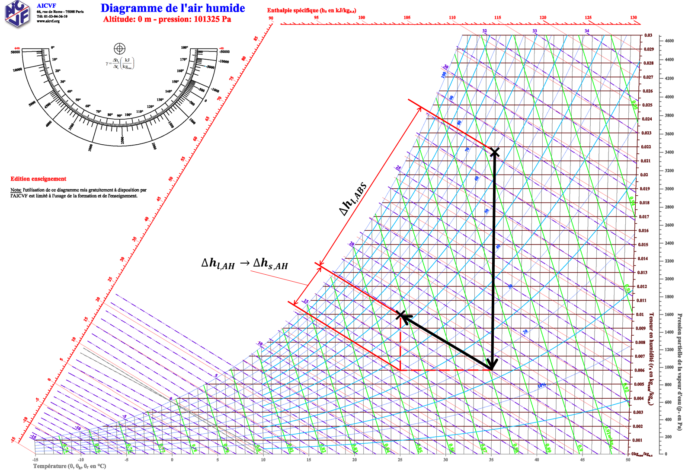
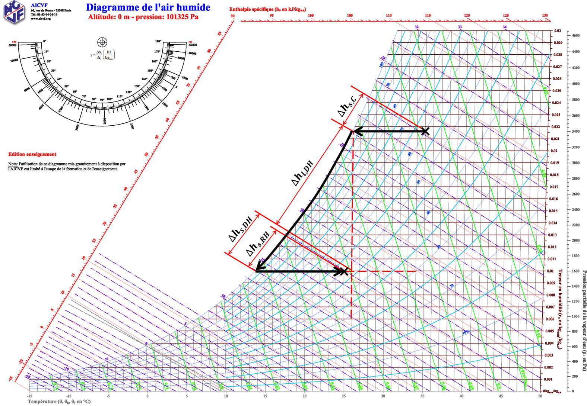

# DSH Project: Dehumidification by absorption vs dehumidification by cooling and reheating

This is the project of Silvan Steiger and Immanuel Plattner for the EVA_DSH module. In this project two different methods for dehumidification and cooling on a hot summer day are investigated and compared in respect to energy consumption.

The first method uses an absorbtion process to dehumidify the air adiabatic humidification to cool the air. First, the moist and hot air is brought into contact with a highly concentrated salt solution. The salt solution absorbs water from the air, which dehumidifies the air. In a second step, the dried air is adiabatically humidified to bring it to the desired indoor temperature temperature. The figure below illustrates this procedure in a psychrometric diagram.

The second method is dehumidification and cooling using a state of the art HVAC system with variable air flow rate (VAV). In such as system the hot and humid air is first cooled down to condensate water out of the air and therefore dehumidifing it. After that the dried air is reheated to achieve the desired indoor temperature. The figure below illustrates this procedure in a psychrometric chart.

 This link will open the **jupyter notebook** on binder. Make sure to restart the kernel and run all cells once the jupyter notebook is displayed. This makes sure the widgets are displayed and the computations are done. You can use two widgets to change the indoor and outdoor conditions. Make sure the re-execute all code cells below the widget in which you changed values. Only then are the computations repeated with your new valus.

 This link will open the **voila webpage** of the jupyter notebook above. This hides all code cells and only shows you the markdown and widgets. Note that if you change the values in the widgets, the other code cells are not re-execute! This meands all computations below the changed widgets are not correct anymore (do not fit the new values)!